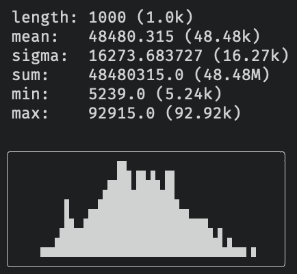

### `stats`: summarize piped numbers or strings
Requires Python 2.6 or greater, with no other dependencies.
```bash
curl -O https://raw.githubusercontent.com/aminnj/stats/main/stats && chmod u+x stats
```

If numbers are detected, print out statistics.
```bash
$ seq 1 10000 | stats

    count:  10000 (10.0k)
    mean:   5000.5 (5.0k)
    std:    2886.89567991 (2.89k)
    sum:    50005000.0 (50.01M)
    min:    1.0 (1.0)
    max:    10000.0 (10.0k)

# An optional argument specifies the column number to shortcut piping
# through `awk '{print $i}'` and allow negative indexing.
# A `-b` switches humanized numbers to base-2.
$ hadoop fs -du / | stats 1 -b

    length: 26 (26.0)
    mean:   6.4025619941e+11 (596.29 GiB)
    sigma:  1.54554065089e+12 (1.41 TiB)
    sum:    1.66466611847e+13 (15.14 TiB)
    min:    5207981.0 (4.97 MiB)
    max:    5.34309043154e+12 (4.86 TiB)

```

A thumbnail histogram is also drawn to visually highlight any irregularities.
```bash
$ for x in {1..1000}; do echo $((RANDOM + RANDOM)); done | stats
```



If strings are detected, print frequencies (similar to `uniq -c`) with bars.
```bash
$ ls -l ~/public_html | stats -3
╭──────┬──────────────────────╮
│ Jul  │ ██████████████ (14)  │
│ Mar  │ █████████ (9)        │
│ Feb  │ ███████ (7)          │
│ Aug  │ ██████ (6)           │
│ Sep  │ █████ (5)            │
│ Nov  │ █████ (5)            │
│ Apr  │ ████ (4)             │
│ May  │ ███ (3)              │
│ Oct  │ ███ (3)              │
│ Jan  │ ██ (2)               │
│ Jun  │ █ (1)                │
│ Dec  │ █ (1)                │
╰──────┴──────────────────────╯

# Only ascii if output is piped/redirected
$ condor_q -af MATCH_EXP_JOB_Site | stats > temp.txt ; cat temp.txt
foo | **** (4)
bar | ** (2)
baz | * (1)
```
